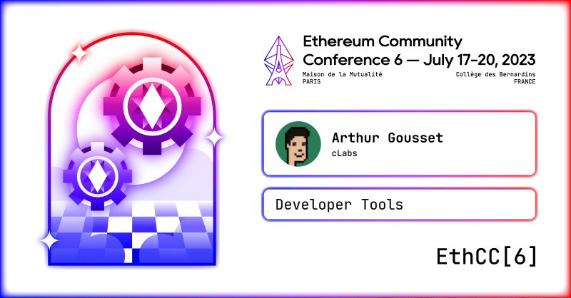

# EthCC Presentation

A repository with the material for my presentation at EthCC 🇫🇷

## TLDR

+	🌠 Slides: [PDF](./slides/slides.pdf)
+	🛠️ Code: [`index.js`](./code/index.js)
+	📽️ YouTube: [Arthur Gousset - Building with purpose, building for all.](https://www.youtube.com/watch?v=VB5jktz6f2U)
	

## Details

+	Title: **Building with purpose, building for all**. Introducing [SocialConnect](socialconnect.dev) and rediscovering Celo's fee currency feature.
+	Date: **Thu, Jul 20 2023**
+	Location: **Paris, France** 🇫🇷
+	Conference: **EthCC 6**

