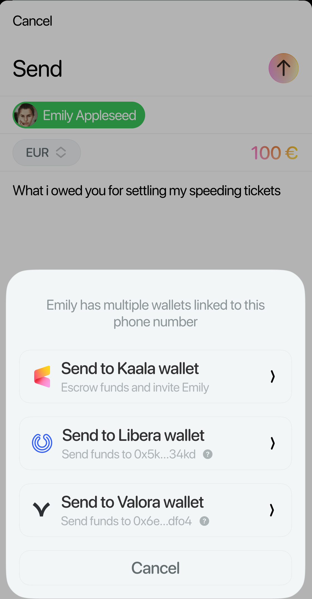

# EthCC 6 - Building with purpose, building for all

### Introducing SocialConnect and rediscovering Celo's fee currency feature

Presentation and material available on Github: [0xarthurxyz/ethcc-presentation](https://github.com/0xarthurxyz/ethcc-presentation)

---

## Agenda

+	Convenient gas payments with (`feeCurrency` feature)
+	User-friendly account discovery (SocialConnect plugin)

---
# Part 1: Alternative gas currencies

---
## User experience

### Crypto-native UX

Before:

1.	User wants to acquire NFT for $10
1.	User onboards with fiat (e.g. credit card) and expects to pay $10
1. 	User gets 10 USD stablecoin
1.	User expects to transfers 10 USD stablecoin for NFT but must pay gas in native token
1. 	User must acquire native token to pay gas (swap, exchange, buy extra token to pay gas)
1. 	User transfers $10, pays gas in native token and is left with dust in native token

---
## Crypto-newbie UX

After:

1.	User wants to acquire NFT for $10
1.	User onboards with fiat (e.g. credit card) and expects to pay $10
1. 	User gets 10 USD stablecoin
1.	User transfers 10 USD stablecoin for NFT and pays gas in stablecoin
1. 	User transfers $10, pays gas in stablecoin and is left with no dust

---
## How?

+	`feeCurrency` transaction field on Celo blockchain
+	`viem` SDK
+	cUSD (\$), cREAL (R\$), or cEUR (€) fee currencies on Celo

---
## Example

```ts
import 'viem' from "viem"
import { celo } from "viem/chains"
import { stableTokenABI } from "@celo/abis"
```

1. set up client
2. send transaction

```ts
const transaction = {
    from: account.address,
    to,
    value: parseEther(value),
    feeCurrency: FEE_CURRENCIES["cusd"],
  }
```


Note: client with celo `chain` parameter is main innovation

```ts
const FEE_CURRENCIES = {
  cusd: "0x874069Fa1Eb16D44d622F2e0Ca25eeA172369bC1",
  creal: "0xE4D517785D091D3c54818832dB6094bcc2744545",
  ceur: "0x10c892A6EC43a53E45D0B916B4b7D383B1b78C0F",
}
```

---
## Demo

Run `yarn demo` to make demo transaction.

Notes-to-self (REMOVE BEFORE TALK):

-	Show sender balance before
-	Make transaction (using script)
-	Show sender balance after
-	Open celoscan or celo explorer to see transaction

---
## Technical details

+	`feeCurrency` implementation (whitelist, validator flows)
+	`viem` implementation (transaction serialiser, EIP27.. wrapper)
+	[WalletConnect v2 passes the feeCurrency field]
+	stable token protocol (Mento protocol, but arbitrary token can be used)

___

This is something any chain can implement/customise in viem SDK.

---
# Part 2: SocialConnect

---
## Metamask


---
## Ledger


---


---
## 1 - Obfuscate


Our **privacy** API lets developers obfuscate identifiers while maintaining **interoperability** across applications.

---
## 2 - Register


Our SDK gives developers complete **freedom** to design **verification** flows and **register** identifiers.

---
## 3 - Search


Our SDK lets developers design **delightful** and intuitive **user experiences**.

---


<!--  -->


---
## Mapping


---
# asd

+	plaintext: $\text{+54 182 143 21743} \longrightarrow \text{0x76a4dac...a7315}$
+	hash: $\text{ea2ea...a9d55c} \longrightarrow \text{0x76a4dac...a7315}$
	where $\text{hash(+54 182 143 21743)} = \text{ea2ea...a9d55c}$
+	salted hash: 

| Format | Phone number | Public address |
| -- | ------------ | ----------- |
| Plaintext | $\text{+54 182 143 21743}$ | $\text{0x76a4dac...a7315}$ |
| Hashed | $\text{hash(+54 182 143 21743)} = \text{ea2ea...a9d55c}$ | $\text{0x76a4dac...a7315}$ |

---

| Format | Input | Output |
| -- | ------------ | ----------- |
| Plaintext | $\text{+54 182 143 21743}$ | $\text{+54 182 143 21743}$ |
| Hashed | $hash\text{(+54 182 143 21743)}$ | $\text{ea2eaa...30a9d55c}$ |
| Salted hash | $saltedhash\text{(+54 182 143 21743 + abcdef)}$ | $\text{f85b07...b2954ad7}$ |

---

| Format | Obfuscation | Output |
| -- | ------------ | ----------- |
| Plaintext | none | $\text{+54 182 143 21743}$ |
| Hash | $\text{hash}(phoneNumber)$ | $\text{ea2eaa...30a9d55c}$ |
| Salted Hash | $\text{saltedHash}(phoneNumber + salt)$ | $\text{f85b07...b2954ad7}$ |