# EthCC 6 - Building with purpose, building for all

### Introducing SocialConnect and rediscovering Celo's fee currency feature

Presentation on Github: [0xarthurxyz/ethcc-presentation](https://github.com/0xarthurxyz/ethcc-presentation)

<!-- ---

## Table of content

+	Part 1: Rediscovering Celo's **fee currency** feature
+	Part 2: Introducing **SocialConnect** 

I'm speaking on behalf of a lot of brilliant people who worked on Celo.
I appreciate your time and the priviledge to be here and share some of the work we have been doing.

A little bit about me, I work at cLabs, we are an infrastructure company building public goods
for the Celo ecosystem.
-->

---
## Abstracting the concept of gas currencies

+	User experience with native tokens: `CELO`, `ETH`, ...
+	User experience with stabletokens: `cUSD`, `cEUR`, ...

---
## Get started using fee currencies

```ts
import 'viem' from "viem"
import { celo } from "viem/chains"
import { stableTokenABI } from "@celo/abis"
```

```ts
const transaction = {
    from: account.address,
    to,
    value: parseEther(value),
    feeCurrency: FEE_CURRENCIES["cusd"],
}
```

🔗 Full demo on Github: [0xarthurxyz/ethcc-presentation](https://github.com/0xarthurxyz/ethcc-presentation)

---
# Part 2: Introducing SocialConnect

---
## Abstracting the concept of hexadecimal addresses

+	User experience with **hexadecimal** addresses: `0x76a4dac...a7315`
+	User experience with **phone** numbers, **email** addresses, and other social identifiers: `+54 182 143 21743`, `alice@example.com`, ...

---
## Get started using SocialConnect

```ts
// upload identifier -> address mapping to onchain registry
await federatedAttestationsContract.registerAttestationAsIssuer(
	obfuscatedIdentifier,
	account,
	NOW_TIMESTAMP
);
```

```ts
// lookup onchain mapping
const attestations = federatedAttestationsContract.lookupAttestations(
	obfuscatedIdentifier, 
	[ this.issuer.address, ]
);
```

🔗 Full demo website: [socialconnect.dev](https://www.socialconnect.dev/)

---
## Next steps

+	Learn more: [socialconnect.dev](https://www.socialconnect.dev/)
+	Join: ETHGlobal Paris hackathon
+	Find me: [@0xarthurxyz](https://twitter.com/0xarthurxyz)

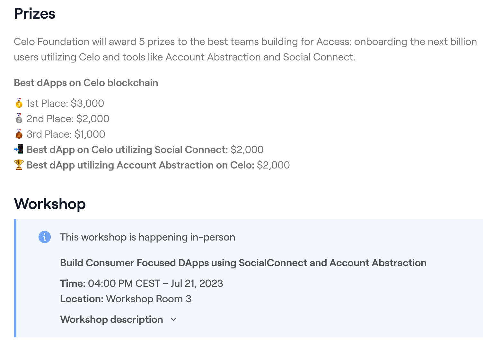

---
## Appendix

---
## Fee currency - Technical details

+	`feeCurrency` feature uses a whitelist of tokens accepted as fee currencies
+	`viem` now has extensible transaction serialisers (uses EIP2718 to create a compliant TransactionType)
+	WalletConnect v2 passes the `feeCurrency` field in the transaction object

---
## SocialConnect Mapping

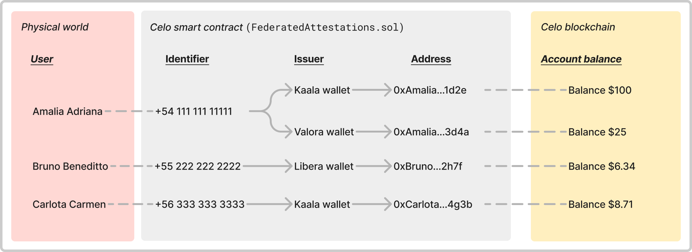

---

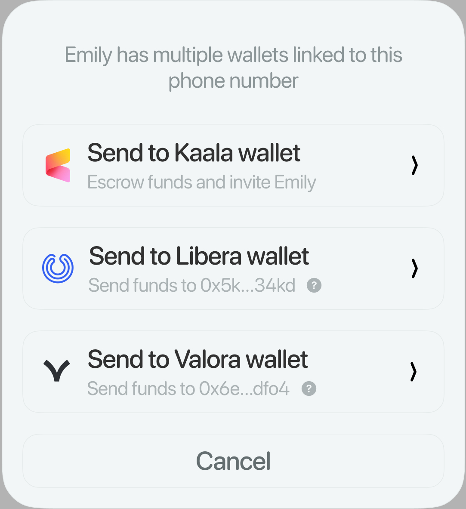

---
## 1 - Obfuscate


Our **privacy** API lets developers obfuscate identifiers while maintaining **interoperability** across applications.

---
## 2 - Register

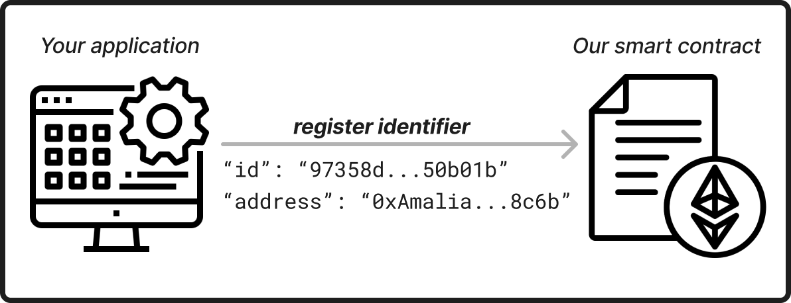

Our SDK gives developers complete **freedom** to design **verification** flows and **register** identifiers.

---
## 3 - Search

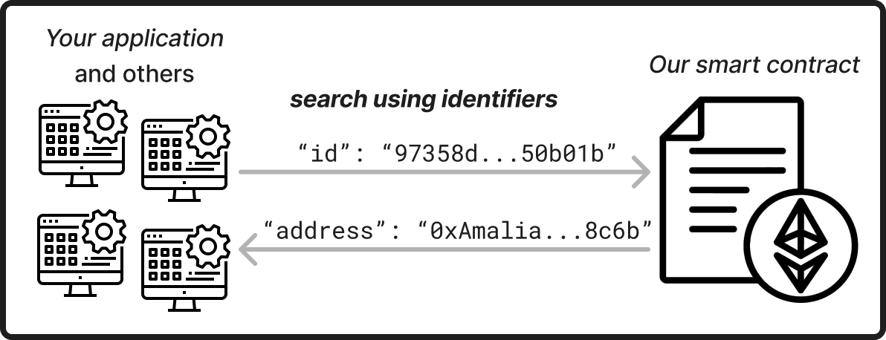

Our SDK lets developers design **delightful** and intuitive **user experiences**.

---
## Metamask

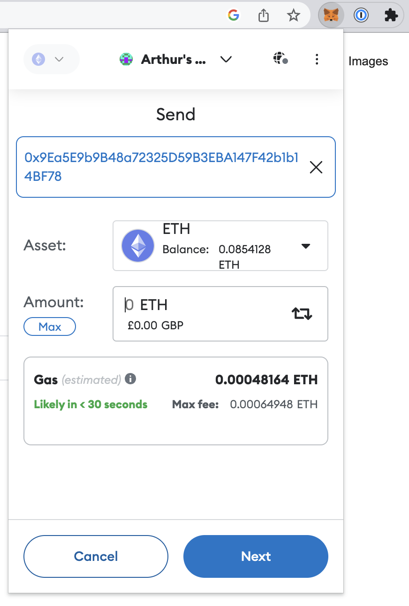

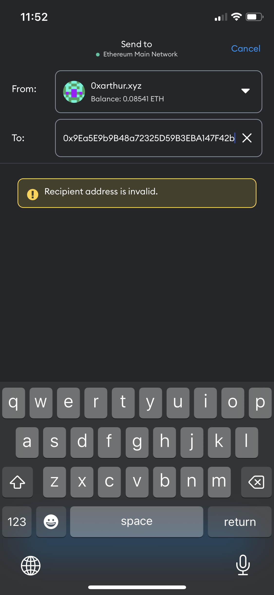

---
## Ledger

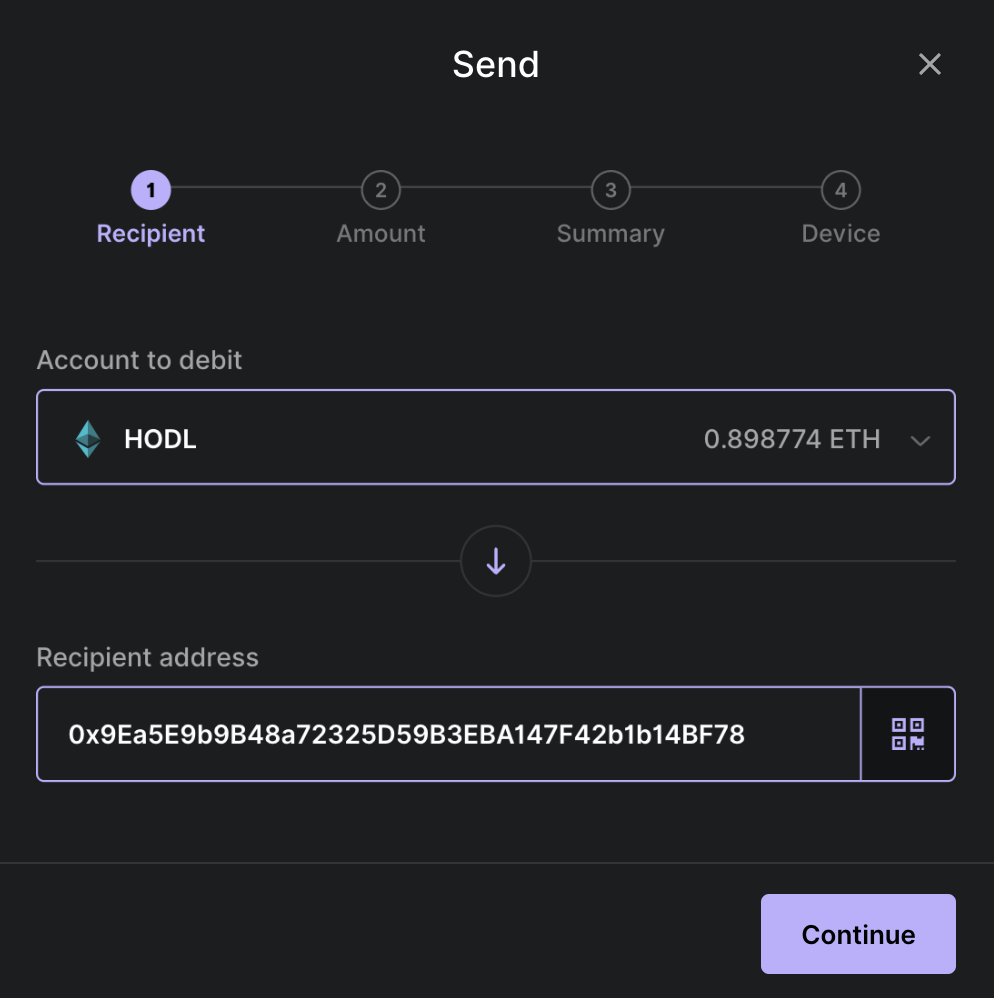

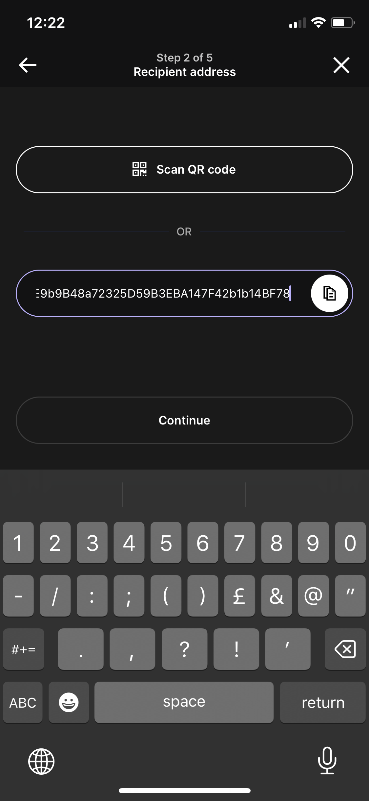

---

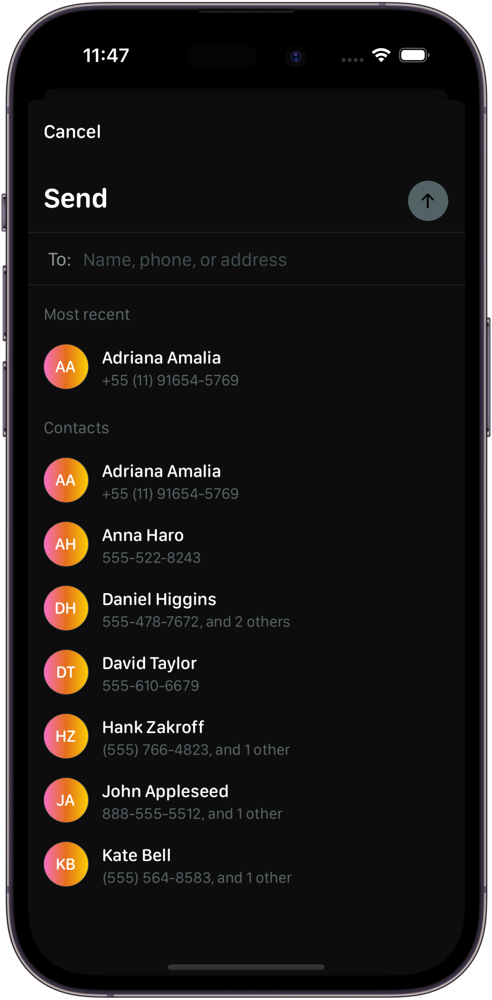

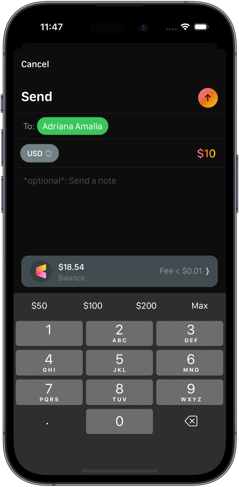

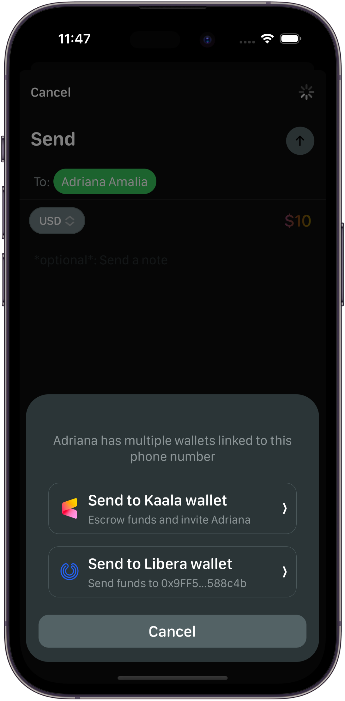

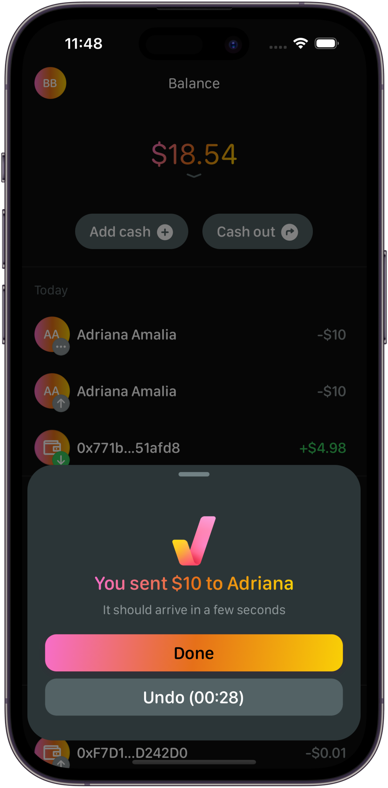

<!-- 
---
# asd

+	plaintext: $\text{+54 182 143 21743} \longrightarrow \text{0x76a4dac...a7315}$
+	hash: $\text{ea2ea...a9d55c} \longrightarrow \text{0x76a4dac...a7315}$
	where $\text{hash(+54 182 143 21743)} = \text{ea2ea...a9d55c}$
+	salted hash: 

| Format | Phone number | Public address |
| -- | ------------ | ----------- |
| Plaintext | $\text{+54 182 143 21743}$ | $\text{0x76a4dac...a7315}$ |
| Hashed | $\text{hash(+54 182 143 21743)} = \text{ea2ea...a9d55c}$ | $\text{0x76a4dac...a7315}$ |

---

| Format | Input | Output |
| -- | ------------ | ----------- |
| Plaintext | $\text{+54 182 143 21743}$ | $\text{+54 182 143 21743}$ |
| Hashed | $hash\text{(+54 182 143 21743)}$ | $\text{ea2eaa...30a9d55c}$ |
| Salted hash | $saltedhash\text{(+54 182 143 21743 + abcdef)}$ | $\text{f85b07...b2954ad7}$ |

---

| Format | Obfuscation | Output |
| -- | ------------ | ----------- |
| Plaintext | none | $\text{+54 182 143 21743}$ |
| Hash | $\text{hash}(phoneNumber)$ | $\text{ea2eaa...30a9d55c}$ |
| Salted Hash | $\text{saltedHash}(phoneNumber + salt)$ | $\text{f85b07...b2954ad7}$ |
-->